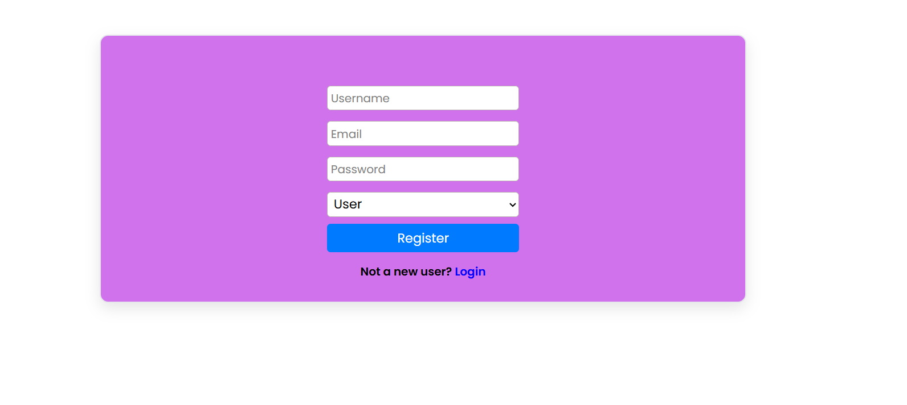
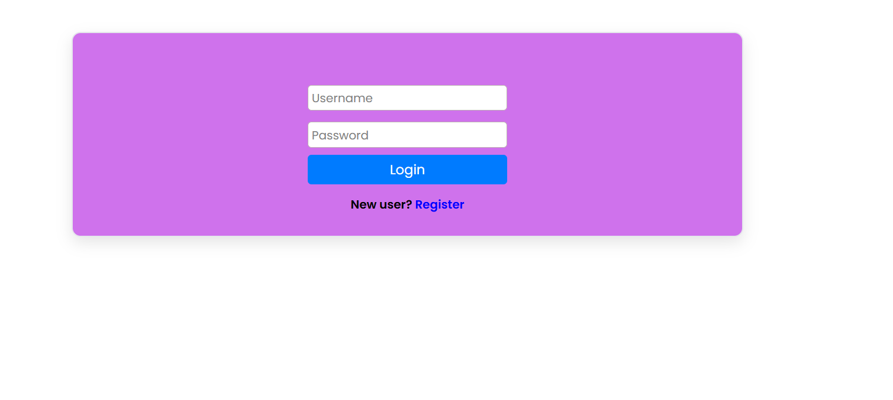
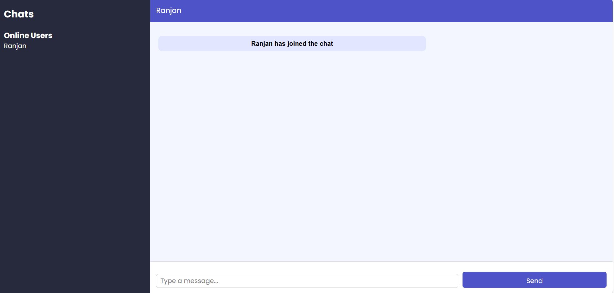

# 💬 Real-Time Chat Application

A full-stack real-time chat application with user authentication, live messaging, and online user tracking.

---

## 📸 Screenshots

### 🔐 Login Page
> Existing users can sign in with their username and password.



---

### 📝 Register Page
> New users can create an account by providing a username, email, password, and selecting a role (User/Admin).



---

### 💬 Chat Interface
> Once logged in, users can see who's online and send real-time messages in the chat room.



---

## ✨ Features

- 🔐 **User Authentication** — Register and login with username & password
- 👤 **Role-Based Access** — Choose between `User` and `Admin` roles at registration
- 🟢 **Online Users Sidebar** — See who is currently online in real time
- 💬 **Live Messaging** — Send and receive messages instantly
- 📢 **Join Notifications** — System message shown when a user joins the chat
- 📱 **Clean & Responsive UI** — Simple, modern interface for all screen sizes

---

## 🛠️ Tech Stack

| Layer | Technology |
|-------|-----------|
| Frontend | HTML / CSS / JavaScript |
| Backend | Node.js / Express |
| Real-Time | Socket.IO |
| Database | MongoDB |


---

## 🚀 Getting Started

### Prerequisites

- Node.js (v16+)
- npm or yarn
- MongoDB

### Installation

```bash
# Clone the repository
git clone https://github.com/tiwariharshit07/webdevelopment.git

# Navigate into the project directory
cd webdevelopment

# Install dependencies
npm install
```

### Running the App

```bash
# Start the development server
npm run dev

# Or for production
npm start
```


## 📁 Project Structure

```
├── controllers/          # Business logic
├── database/
│   └── db.js             # MongoDB connection
├── models/
│   └── user.js           # User schema
├── routes/               # API routes
├── .env                  # Environment variables
├── .gitignore
├── index.html            # Frontend
├── server.js             # Main entry point
├── package.json
└── README.md
```

---

## 🔧 Environment Variables

Create a `.env` file in the root directory:

```env
PORT=3000
MONGO_URI=your_mongodb_connection_string
JWT_SECRET=your_jwt_secret_key
```

---

## 🤝 Contributing

Contributions are welcome! Please follow these steps:

1. Fork the repository
2. Create a new branch: `git checkout -b feature/your-feature-name`
3. Commit your changes: `git commit -m "Add your message"`
4. Push to the branch: `git push origin feature/your-feature-name`
5. Open a Pull Request

---

